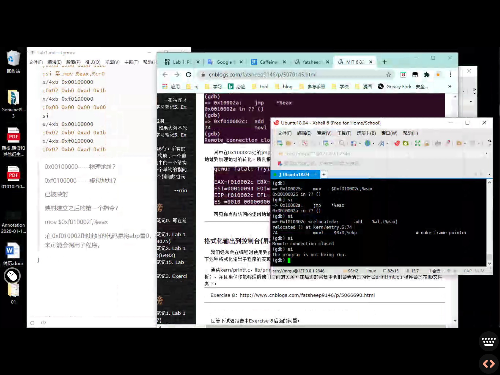

实模式地址：物理地址 = 16*段地址+偏移。

BIOS 储存在ROM中，为操作系统和应用程序提供基本的I/O服务。

<h3>
    Part1:  电脑引导程序
</h3>

目的是介绍x86汇编语言*`(已完成，看文件夹pcasm-book)`*和电脑引导的过程，并且教会使用QEMU和QEMU/GDB进行debug。在这部分不用写代码，但是需要弄清楚下面的这些问题。

<h4>开始x86汇编</h4>

如果对汇编语言不熟悉，pcasm-book是一本很好的书。但是它是nasm汇编语言，我们要使用的是GNU汇编语言。在下面这个的 *Brennan‘s Guide to Inline Assembly* 中介绍了如何将他们互相转换。

**练习1：**

熟悉下面这个连接中的汇编语言，不需要现在去阅读，可以将它们作为参考。

> https://pdos.csail.mit.edu/6.828/2018/reference.html

建议阅读[Brennan's Guide to Inline Assembly](http://www.delorie.com/djgpp/doc/brennan/brennan_att_inline_djgpp.html)的语法部分，他很好地描述了我们在JOS中会用到的GNU汇编语言。

这里给出了两个*Intel80386*的参考连接。

> 1.https://pdos.csail.mit.edu/6.828/2018/readings/i386/toc.htm
>
> 2.https://software.intel.com/content/www/us/en/develop/articles/intel-sdm.html?iid=tech_vt_tech+64-32_manuals

<h4>模拟x86</h4>

我们不会把操作系统在真实的计算机上使用，而是使用程序仿真模拟一台计算机。在仿真机器上写的代码也可以引导真实的计算机。使用仿真机器可以简化debug工作。

在6.828中，我们使用qemu仿真。由于qemu固有监视器的debug限制，我们使用GNU远程进行debug将qemu当作gdb的远程调试目标。在本实验中我们使用它来度过早期的引导过程。

当输入完*`make qemu-nox`*之后，会进入qemu虚拟机，内核是jos。终端上会显示一些内容，在*`Booting from Hard Disk`*之后，是由jos内核输出的。

有两个可以给内核监听器的命令*`help`*和*`kerninfo`*。

> K> help
>
> help - display this list of commands
>
> kerninfo - display information about the kernel
>
> K> kerninfo
>
> Special kernel symbols:
>
> ​	 entry    f010000c  (virt)    0010000c  (phys)
>
> ​	 etext    f0101a75  (virt)    00101a75  (phys)
>
> ​     edata   f0112300  (virt)    00112300  (phys)
>
> ​	 end      f0112960  (virt)    00112960  (phys)
>
> Kernel executable memory footprint: 75KB

来讨论下*`kerninfo`*命令的输出。虽然输出的内容很简单，但是它给出了一个重要的信息：内核监视器是“直接”运行在仿真计算机的“RAW*(虚拟)*硬盘”上的。这意味着可以直接复制*`obj/kern/kernel.img`*的内容到真实硬盘的前几个扇区，然后把硬盘插到电脑上启动，会看到电脑屏幕出现和qemu窗口一样的内容。但是不建议这么做，原硬盘的引导会被覆盖，硬盘以前的内容会丢失。

<h4>PC物理地址空间</h4>

现在去深入了解更多电脑启动的细节。电脑的物理地址空间是硬线(???hard-wired)有以下的常规布局：

```
+------------------+  <- 0xFFFFFFFF (4GB) 
|      32-bit      | 
|  memory mapped   | 
|     devices      | 
|                  | 
/\/\/\/\/\/\/\/\/\/\

/\/\/\/\/\/\/\/\/\/\ 
|                  | 
|      Unused      | 
|                  | 
+------------------+  <- depends on amount of RAM 
|                  | 
|                  | 
| Extended Memory  | 
|                  | 
|                  | 
+------------------+  <- 0x00100000 (1MB) 
|     BIOS ROM     | 
+------------------+  <- 0x000F0000 (960KB) 
|  16-bit devices, | 
|  expansion ROMs  | 
+------------------+  <- 0x000C0000 (768KB) 
|   VGA Display    | 
+------------------+  <- 0x000A0000 (640KB) 
|                  | 
|    Low Memory    | 
|                  | 
+------------------+  <- 0x00000000
```

> 注意！从下向上的内存顺序！

首批电脑基于16位Intel 8088处理器，只能处理1MB的物理内存。因此早期电脑的物理内存空间开始于0x00000000，结束于0x000FFFFF而不是0xFFFFFFFF。这640KB的区域被标记为“Low Memory”，是早期电脑唯一可以使用的随机存取存储器。最早的电脑实际上只能配置16KB，32KB或64KB的随机存取存储器。

从0x000A0000到0x000FFFFF的384KB区域，有特殊用途，例如视频显示缓冲区和非易失性存储器中保存的固件。最重要的保留区域是BIOS，它占据了从0x000F0000到0x000FFFFF的64KB。在早期的计算机中，BIOS是存储在ROM中的，但现代的计算机BIOS则存储在可更新的FLASH闪存中。BIOS负责执行基本的系统初始化，如激活视频卡，检查已安装的内存量。在初始化之后，BIOS会从软盘、硬盘、CD-ROM或网络中加载操作系统，将控制权转交给操作系统。

当Intel在80286和80386上打破了1MB限制后，为了确保向下兼容现存软件，PC 架构还是保留着 1 MB 以内物理地址空间的原始布局。因此，现代计算机在物理内存的0x000A0000到0x00100000之间有一个“空洞”，将RAM分为“低”或“常规内存”（前640KB）和“扩展内存”（其他所有）。此外，电脑的32位物理地址空间中顶层的某些空间（在所有物理RAM之上）现在通常留给BIOS供32位PCI设备使用。

最近x86处理器可以支持超过4GB的物理RAM，所以RAM可以扩展到远超0xFFFFFFFF。在这种情况下，BIOS必须在系统的RAM的32位可寻址区域的顶部留下第二个“空洞”，来为这些32位设备留出可映射的空间。由于设计的限制，JOS只能用电脑物理内存的前256MB，所以现在假设所有电脑都只有32位物理地址空间。但是处理复杂的物理地址空间和硬件组织的其他方面是os开发的重大挑战。

<h4>ROM BIOS</h4>

在实验的这部分将尝试使用qemu的debug功能来研究IA-32兼容计算机的启动方式。

打开两个终端窗口，转到lab目录下。在窗口一输入*`make qemu-nox-gdb`*。qemu启动了，但是qemu会在处理第一条指令之前停止并等待GDB的调试链接。在窗口2中，运行*`make gdb`*。应该看到下面这些东西。

```
athena% make gdb
GNU gdb (GDB) 6.8-debian
Copyright (C) 2008 Free Software Foundation, Inc.
License GPLv3+: GNU GPL version 3 or later <http://gnu.org/licenses/gpl.html>
This is free software: you are free to change and redistribute it.
There is NO WARRANTY, to the extent permitted by law.  Type "show copying"
and "show warranty" for details.
This GDB was configured as "i486-linux-gnu".
+ target remote localhost:26000
The target architecture is assumed to be i8086
[f000:fff0] 0xffff0:	ljmp   $0xf000,$0xe05b
0x0000fff0 in ?? ()
+ symbol-file obj/kern/kernel
(gdb) 
```

.gdbinit文件设置了GDB来调试在早期boot中的16位代码，并指示它附加到侦听的qemu。

接下来有一行：

```
[f000:fff0] 0xffff0:	ljmp   $0xf000,$0xe05b
```

是GDB对执行的第一条命令的反汇编。从这个输出中可以看出：

- IBM PC从物理地址0x000ffff0开始执行，该地址位于为ROM BIOS保留的64KB的最顶部。
- PC从*`CS = 0xf000`*和*`IP = 0xfff0`*开始执行
- 第一条执行的指令是*`jmp`*指令，将跳转到*`CS = 0xf000`*和*`IP = 0xe05b`*

这是8088处理器的设计。BIOS是硬线连接到物理地址范围0x000f0000-0x000fffff的，所以一个确保BIOS在电脑通电或系统重启之后能够首先获得电脑控制权的设计很重要，因为通电时没有一个可执行的软件在机器的RAM中。qemu仿真自带BIOS，放置在处理器的模拟物理地址空间的此位置。当处理器复位后，模拟的处理器进入实模式，将CS设为0xf000，IP设为0xfff0，执行从(CS:IP)段地址开始。如何把段地址变为物理地址：

> 实模式地址：物理地址 = 16*段地址(CS)+偏移(IP)

计算之后，结果是0xffff0。

0xffff0是在BIOS结束前的16字节。因此BIOS要做的第一件事情是jmp到BIOS中较早的位置也是可以理解的。

**练习二：**

使用GDB的*`si`*命令跟踪ROM BIOS。知道BIOS会先做什么。

> cr0-cr3:  https://www.cnblogs.com/iamfy/archive/2012/05/10/2495044.html
>
> 间接寻址：
>
> - `SecTION:[BASE + INDEX * SCALE + DISP]` (Intel格式)
> - `SECTION:disp(base, index, scale)` (AT&T格式)
>
> AT&T语法中立即形式的远跳转和远调用为`ljmp/lcall $section, $offset`，而Intel的是`jmp/call far section:offset`。同样，AT&T语法中远返回指令`lret $stack-adjust`对应Intel的`ret far stack-adjust`

```assembly
;cs:ip 实地址 指令
[f000:fff0] 0xffff0: ljmp $0xf000,$0xe05b
;jmp to 0xfe05b
[f000:e05b] 0xfe05b: cmpl $0x0,%cs:0x6ac8
;%cs:0x6ac8 是一个地址，类似于cs:ip 将0x0这个立即数和%cs:0x6ac8所代表的内存地址的值比较
[f000:e062] 0xfe062: jne 0xfd2e1
;if %cs:0x6ac8 != 0x0 jump to 0xfd2e1
[f000:e066] 0xfe066: xor %dx,%dx
;dx = 0 & didn't jump
[f000:e068] 0xfe068: mov %dx,%ss
;ss = 0
[f000:e06a] 0xfe06a: mov $0x7000,%esp
;esp = 0x7000
[f000:e070] 0xfe070: mov $0xf34c2,%edx
;edx = 0xf34c2
[f000:e076] 0xfe076: jmp 0xfd15c
[f000:d15c] 0xfd15c: mov %eax,%ecx
;ecx = eax
[f000:d15f] 0xfd15f: cli
;关闭中断指令，关闭可屏蔽的中断
[f000:d160] 0xfd160: cld
;设置方向标识位为0，表示内存地址方向变化从低地址值变为高地址
[f000:d161] 0xfd161: mov $0x8f,%eax
;eax = 0x8f
[f000:d167] 0xfd167: out %al,$0x70
;out用于操作IO端口
;out PortAddress,%al 把al的值输入到端口地址为PortAddress的端口
[f000:d169] 0xfd169: in $0x71,%al
;把端口地址的值读到al中
[f000:d16b] 0xfd16b: in $0x92,%al
[f000:d16d] 0xfd16d: or $0x2,%al
[f000:d16f] 0xfd16f: out %al,$0x92
[f000:d171] 0xfd171: lidtw %cs:0x6ab8
[f000:d177] 0xfd177: lgdtw %cs:0x6a74
;lidt m16/m32 将操作数中的值加载到中断描述符表格寄存器(IDTR)
;lgdt m16/m32 将操作数中的值加载到全局描述符表格寄存器(GDTR)
[f000:d17d] 0xfd17d: mov %cr0,%eax
;eax = cr0
[f000:d180] 0xfd180: or $0x1,%eax
;eax最低位 = 1
[f000:d184] 0xfd184: mov %eax,%cr0
;cr0 = eax
[f000:d187] 0xfd187: ljmpl $0x8,$0xfd18f
=> 0xfd18f: mov $0x10,%eax
;eax = 0x10
=> 0xfd194: mov %eax,%ds
;ds = eax
=> 0xfd196: mov %eax,%es
;es = eax
=> 0xfd198: mov %eax,%ss
;ss = eax
=> 0xfd19a: mov %eax,%fs
;fs = eax
=> 0xfd19c: mov %eax,%gs
;gs = eax
=> 0xfd19e: mov %ecx,%eax
;eax = ecx
;好像是恢复eax原来的值，猜测是中断方面的相关指令执行完毕
=> 0xfd1a0: jmp *%edx
;jump to edx存储的值做地址
=> 0xf34c2: push %ebx
=> 0xf34c3: sub $0x2c,%esp
;留出来了44个空间
=> 0xf34c6: movl $0xf5b5c,0x4(%esp)
;??? 0x4 和 esp有啥关系吗？ 也许是栈上位置的关系
;esp+0x4 = 0xf5b5c
=> 0xf34ce: movl $0xf447b,(%esp)
;什么用法？？？
;(%esp) = 0xf447b
=> 0xf34d5: call 0xf099e
;jump to 0xf099e
=> 0xf099e: lea 0x8(%esp),%ecx
;计算esp+0x8所存的数，存到ecx中
=> 0xf09a2: mov 0x4(%esp),%edx
;edx = 0xf5b5c
=> 0xf09a6: mov $0xf5b58,%eax
;eax = 0xf5b58 = edx-4
=> 0xf09ab: call 0xf0574
=> 0xf0574: push %ebp
=> 0xf0575: push %edi
=> 0xf0576: push %esi
=> 0xf0577: push %ebx
=> 0xf0578: sub $0xc,%esp
=> 0xf057b: mov %eax,0x4(%esp)
;now esp+0x4 = eax = 0xf5b58
=> 0xf057f: mov %edx,%ebp
;ebp = edx = 0xf5b5c
=> 0xf0581: mov %ecx,%esi
;esi = ecx
;ecx好像等于最最最开始的eax？
=> 0xf0583: movsbl 0x0(%esp),%edx
;edx = %esp
=> 0xf0587: test %dl,%dl
;test进行与运算，设置标志位，但是两个操作数数值不变
=> 0xf0589: je 0xf0758
=> 0xf058f: cmp $0x25,%dl
=> 0xf0592: jne 0xf0741
=> 0xf0741: mov 0x4(%esp),%eax
;eax恢复？
=> 0xf0745: call 0xefc70
=> 0xefc70: mov %eax,%ecx
;ecx = eax = 0xf5b58?
=> 0xefc72: movsbl %dl,%edx
;edx = dl
=> 0xefc75: call *(%ecx)
;call (ecx的值的值为地址)
=> 0xefc65: %edx,%eax
;eax = edx = dl?
=> 0xefc67: mov 0xf693c,%dx
;dx = 0xf693c
=> 0xefc6e: out %al,(%dx)
;al的值输出到$0xf693c端口
=> 0xefc6f: ret
;call还未返回的，现有3个
=> 0xefc77: ret
;call - 2
=> 0xf074a: mov %ebp,%ebx
;ebx = ebp
=> 0xf074c: jmp 0xf0750
=> 0xf0750: lea 0x1(%ebx),%ebp
=> 0xf0753: jmp 0xf0583
;jump回了前面
=> 0xf0583: movsbl 0x0(%ebp),%edx
=> oxf0587: test %dl,%dl
=> 0xf0589: je 0xf0758
=> 0xf058f: cmp $0x25,%dl
=> 0xf0592: jne 0xf0741
=> 0xf0741: mov 0x4(%esp),%eax
=> 0xf0745: call 0xefc70
=> 0xefc70: mov %eax,%ecx
=> 0xefc72: movsbl %dl,%edx
=> 0xefc75: call *(%ecx)
;之后进入了无限循环？？？
```

当BIOS启动的时候，它设置一个中断描述符表并初始化诸多设备。

在初始化PCI总线和所有BIOS知道的重要设备后，它会寻找一个可引导的设备，如：软盘、硬盘驱动器或CD-ROM。最终，当找到一个引导盘时，BIOS读取引导程序，并将控制权转移给程序。

<h3>
    Part2 引导加载
</h3>
PC的软盘和硬盘被分为512字节大小，每一个这样大的区域被称为扇区。扇区是磁盘的最小传输粒度：每一个读或写操作必须是一个或多个扇区，且和扇区的边界对齐。如果硬盘是可引导的，那么它的第一个扇区是引导扇区。当BIOS找到了一个可引导的软盘或硬盘，它会把512字节的引导扇区加载到内存地址0x7c00到0x7dff的内存中，然后使用*`jmp`*命令将CS:IP设置为0000:7c00，将控制权转交给引导加载器。像BIOS加载地址一样，这些地址是任意的，但它们对于PC是固定的和标准化的。

随着 PC 的技术进步，它们可以从 CD-ROM 中引导，因此，PC 架构师对引导过程进行轻微的调整。最后的结果使现代的 BIOS 从 CD-ROM 中引导的过程更复杂（并且功能更强大）。CD-ROM 使用 2048 字节大小的扇区，而不是 512 字节的扇区，并且，BIOS 在传递控制权之前，可以从磁盘上加载更大的（不止是一个扇区）引导镜像到内存中。更多内容，请查看 [“El Torito” 可引导 CD-ROM 格式规范](https://link.zhihu.com/?target=https%3A//sipb.mit.edu/iap/6.828/readings/boot-cdrom.pdf)。

对于6.828我们使用硬盘引导，这意味着我们的引导加载器必须只能容纳512字节。引导加载器由一个汇编文件`boot/boot.S`和一个C文件`boot/main.c`组成。理解清楚这两个文件可以彻底理解发生了什么。引导加载器主要做了两件事情：

> http://bochs.sourceforge.net/techspec/PORTS.LST 这个链接很重要，好像讲的是接口的内容
>
> https://developer.aliyun.com/article/767144 用于参考.text等

1.首先，引导加载器将处理器从实模式切换到32位保护模式，因为只有在 32 位保护模式中，软件才能够访问处理器中 1 MB 以上的物理地址空间。

2.然后，引导加载器通过x86的特殊I/O指令直接访问IDE磁盘设备寄存器，从硬盘中读取内核。了解专用 I/O 指令，查看 [6.828 参考页面](https://link.zhihu.com/?target=https%3A//sipb.mit.edu/iap/6.828/reference) 上的 “IDE 硬盘控制器” 章节。

在理解引导加载器源码后，看一下`obj/boot/boot.asm`文件。这个反汇编文件让我们可以更容易地看到引导加载器代码所处的物理内存位置，并且也可以更容易地跟踪在 GDB 中步进的引导加载器发生了什么事情。同样的，`obj/kern/kernel.asm` 文件中包含了 JOS 内核的一个反汇编，它也经常被用于内核调试。

你可以使用 `b` 命令在 GDB 中设置中断点地址。比如，`b *0x7c00` 命令在地址 `0x7C00` 处设置了一个断点。当处于一个断点中时，你可以使用 `c` 和 `si` 命令去继续运行：`c` 命令让 QEMU 继续运行，直到下一个断点为止（或者是你在 GDB 中按下了 Ctrl - C），而 `si N` 命令是每次步进 `N` 个指令。

要检查内存中的指令（除了要立即运行的下一个指令之外，因为它是由 GDB 自动输出的），你可以使用 `x/i` 命令。这个命令的语法是 `x/Ni ADDR`，其中 `N` 是连接的指令个数，`ADDR` 是开始反汇编的内存地址。

**练习3：**

> 这里实在读不懂要干啥，参考了https://www.cnblogs.com/fatsheep9146/p/5115086.html这里
>
> 就是字面上的意思QWQ
>
> [GDT&LDT](https://blog.csdn.net/wrx1721267632/article/details/52056910)

熟悉GDB命令。

>  https://pdos.csail.mit.edu/6.828/2018/labguide.html

在地址 0x7c00 处设置断点，它是加载后的引导扇区的位置。继续运行，直到那个断点。通过代码跟踪`boot/boot.S`，使用的源代码和反汇编文件 **`OBJ/boot/boot.asm`**跟踪你在哪里。也可以在GDB中使用`x/i`命令反汇编引导加载程序中的指令序列，并将原始引导加载程序源代码与`obj/boot/boot.asm` 和GDB中的反汇编进行比较。

在 `boot/main.c` 文件中跟踪进入 `bootmain()` ，然后进入 `readsect()`。识别 `readsect()` 中相关的每一个语句的准确汇编指令。跟踪 `readsect()` 中剩余的指令，然后返回到 `bootmain()` 中，识别 `for` 循环的开始和结束位置，这个循环从磁盘上读取内核的剩余扇区。找出循环结束后运行了什么代码，在这里设置一个断点，然后继续。接下来再走完引导加载器的剩余工作。

**哈哈哈哈哈哈哈我是傻子**

```
cd obj/boot/
```

**就这么难吗？？？**

现在回答问题：

1.处理器从什么时候开始执行32位代码？究竟是什么原因导致从16位模式切换到32位模式？

```assembly
movl %eax,%cr0
;48-51行
;将最后一位置位1保护模式开启，PE打开(???)
ljmp $PROT_MODE_CSEG,$protcseg
;进入32位
```

2.引导加载程序执行 的最后一条指令是什么，刚加载的内核的第一条指令是什么？

```c
((void (*)(void)) (ELFHDR->e_entry))();
```

```assembly
movw    $0x1234,0x472  
;kern entry.S
```

3.内核的第一条指令在哪里？

```assembly
0x0010000c
;objdump -f kernel
;or
;cd obj/kern
;gdb kern
;run
```

4.引导加载程序如何确定必须读取多少个扇区才能从磁盘获取整个内核？它在哪里找到此信息

> https://jiyou.github.io/blog/2018/04/15/mit.6.828/jos-lab1/

```c
ph = (struct Proghdr *) ((uint8_t *) ELFHDR + ELFHDR->e_phoff);
eph = ph + ELFHDR->e_phnum;
for (; ph < eph; ph++)
	// p_pa是需要被加载的地址。
    // p_memsz指的是需要的物理内存的大小
    // p_offset指的是在逻辑上相对于整个文件头的偏移量。
    // 虽然这里p_memsz表示的时候需要占用的内存的大小。
    // 实际上也是磁盘上需要读取的数据量的大小。
    readseg(ph->p_pa, ph->p_memsz, ph->p_offset);
```

<h4>
    加载内核 
</h4>

现在进一步查看引导加载器在boot/main.c中C语言部分的详细细节。但在这之前，要来回顾一下C语言基础。

**练习4**

读`The C Programming Language by Brian Kernighan and Dennis Ritchie `这本书的指针章节5.1—5.5。然后下载 运行[pointers.c](https://link.zhihu.com/?target=https%3A//sipb.mit.edu/iap/6.828/files/pointers.c) 的源代码，然后确保你理解了输出值的来源的所有内容。尤其是，确保你理解了第 1 行和第 6 行的指针地址的来源、第 2 行到第 4 行的值是如何得到的、以及为什么第 5 行指向的值表面上看像是错误的。

解析看[6.828笔记](6.828笔记.pdf)。

要了解 `boot/main.c`，你需要了解 ELF 二进制格式是什么。当你编译和链接一个 C 程序时，比如，JOS 内核，编译器将每个 C 源文件（'`.c`'）转换为一个包含预期硬件平台的汇编指令编码的二进制格式的对象文件（'`.o`'），然后链接器将所有编译过的对象文件组合成一个单个的二进制镜像，比如，`obj/kern/kernel`，在本案例中，它就是 ELF 格式的二进制文件，它表示是一个 ”可运行和可链接格式“。

关于这个格式的全部信息都在[our reference page](https://pdos.csail.mit.edu/6.828/2018/reference.html)的 [the ELF specification](https://pdos.csail.mit.edu/6.828/2018/readings/elf.pdf)上，但是不需要深入了解它的细节。虽然elf格式相当强大复杂，但大部分复杂的部分是为了支持共享库的动态加载。

由于6.828不需要特地去了解elf，所以可以认为elf是一个有加载信息的头文件，之后的几个程序节，每一个都是连续的试图加载到内存中特定地址的的代码块或数据块。引导加载器不会修改代码或数据，它只是将其加载到内存中并运行。

elf二进制文件开始于一段固定长度的elf头，后面跟着一个任意长度的程序头列出每一段要被加载的程序节。C在`inc/elf.h`中定义了elf头。

- `.text`：程序可运行指令。
- `.rodata`：只读数据，比如，由 C 编译器生成的 ASCII 字符串常量。（然而我们并不需要操心设置硬件去禁止写入它）
- `.data`：data段保存程序的初始化数据，比如，初始化的全局变量，比如，像 `int x = 5;`。

当链接器计算程序的内存布局的时候，它为未初始化的全局变量在跟着 `.data`的`.bss` 段保留一些空间。C 规定 "未初始化的" 全局变量以一个 0 值开始。因此，在 ELF 二进制文件中不必存储 `.bss` 中的内容；链接器只记录了`.bss` 的地址和大小。加载器或者程序必须在 `.bss` 节中写入 0。

通过下面的命令检查kernel可执行文件中所有段的所有名字、大小和链接地址列表：

```
athena% objdump -h obj/kern/kernel
```

你会看到更多的段，但是，其它的段对于我们的实验目标来说并不重要。其它的段中大多数都是保留了调试信息，它们一般包含在程序的可执行文件中，但不会被程序加载器加载到内存中。

我们需要特别注意 `.text` 中的 VMA（或者链接地址）和 LMA（或者加载地址）。一个段的加载地址是那个段加载到内存中的地址。

一个段的链接地址是从段执行开始时的内存地址。链接器在二进制代码中以变量的方式去编码这个链接地址，比如，当代码需要全局变量的地址时，如果从未链接的地址去运行，那么将无法运行。（一般是生成一个不包含任何绝对地址的、与位置无关的代码。现代共享库已广泛使用此代码，但是以性能和复杂性为代价，因此我们不会在6.828中使用它。）

一般情况下，链接和加载地址是一样的。比如，通过如下的命令去查看引导加载器的 `.text` 段：

```
athena% objdump -h obj/boot/boot.out
```

引导加载器使用elf程序头来决定如何加载扇区。程序头指明elf的哪一部分加载到内存和它应占据的目的地址。可以通过下面这条命令检查程序头：

```
athena% objdump -x obj/kern/kernel
```

在objdump的输出中程序头会列在"Program Headers"下面。elf中需要被加载进内存中的区域会被标记"LOAD"。给出了每个程序头的其他信息，例如虚拟地址（“ vaddr”），物理地址（“ paddr”）和加载区域的大小（“ memsz”和“ filesz”）。

回到`boot/main.c`，`ph->p_pa`每个程序标头的字段都包含该段的目标物理地址（在这种情况下，它实际上是一个物理地址，尽管ELF规范对该字段的实际含义含糊不清）。

BIOS将引导扇区加载到内存位置0x7c00，因此，这就是引导扇区的加载地址。这也是引导扇区的运行地址，因此，它也是链接地址。我们通过将`-Ttext 0x7C00`传递给`boot / Makefrag中`的链接器来 设置链接地址，因此链接器将在生成的代码中生成正确的内存地址。

**练习5**

如果你得到一个错误的引导加载器链接地址，通过再次跟踪引导加载器的前几个指令，你将会发现第一个指令会 “中断” 或者出错。然后在 `boot/Makefrag` 修改链接地址来修复错误，运行 `make clean`，使用 `make` 重新编译，然后再次跟踪引导加载器去查看会发生什么事情。不要忘了改回正确的链接地址，然后再次 `make clean`！

*根据一些博客的提示，发现了正确操作和答案：*

```assembly
cd boot
vim Makefrag
;修改-Ttext 修改地址
make clean
make
cd ..
objdump -h obj/boot/boot.out
;0 .text   00000187  00002333  00002333  00000077  2**2
;运行出错
```

> https://www.cnblogs.com/fatsheep9146/p/5220004.html
>
> 不同电脑好像结果不一样？？
>
> 所以上述博客仅供参考。

我们继续来看内核的加载和链接地址。与引导加载器不同，这里有两个不同的地址：内核告诉引导加载器加载它到内存的低位地址（小于 1 MB 的地址），但是在一个高位地址运行。

除了段的信息之外，在 ELF 头中还有一个对我们很重要的部分，叫`e_entry`。这个部分保留着程序入口的链接地址：程序的 `.text` 段中的内存地址就是将要被执行的程序的地址。可以用下面的命令来查看程序入口链接地址：

```
athena% objdump -f obj/kern/kernel
```

现在应该能够理解在 `boot/main.c` 中的最小的 ELF 加载器了。它从硬盘中读取内核的每个段，并将它们段的加载地址读入到内存中，然后跳转到内核的入口点。

**练习6**

我们可以用GDB的`x`命令去检查内存。[GDB 手册](https://link.zhihu.com/?target=http%3A//sourceware.org/gdb/current/onlinedocs/gdb_9.html%23SEC63) 上讲的非常详细，但是现在，我们知道命令 `x/Nx ADDR` 是输出地址 `ADDR` 上 `N` 个 *词(word)*就够了。（注意在命令中所有的 `x` 都是小写。）警告： *词(word)*的多少并没有一个普遍的标准。在 GNU 汇编中，一个 *词(word)*是两个字节（在 xorw 中的 'w'，它在这个词中就是 2 个字节）。

重启机器（退出QEMU/GDB，再开始一次）检查在内存0x00100000处的8个word，然后在引导加载程序进入内核时再次检查。他们为什么不同？第二个断点有什么？（您实际上并不需要使用QEMU来回答这个问题。只需考虑一下。）


程序入口好像是0x0010000C？？？

> athena% objdump -f obj/kern/kernel
>
> kernel的开头是entry.S

先后的不一样是因为后面的时候kernel image被加载到了0x00100000处。

<h3>
    内核
</h3>

现在开始更细节的检查JOS的内核。就像引导加载器一样，内核也是从一些汇编语言设置一些东西开始的，以便C程序可以正常运行。

<h4>
    使用虚拟内存解决位置依赖问题
</h4>
前面当检查引导加载器的链接和加载地址时，他们很相适，但其实在内核的链接地址（objdump打印出来的）和加载地址之间有相当大的差距。回顾一下，然后确保你明白了这句话是什么意思。（链接内核比链接引导加载器更加复杂，链接地址和加载地址在`kern/kernel.ld`的最前端）。

操作系统的内核经常喜欢链接并跑在非常高的虚拟地址，如：0xf0100000，这是为了给用户的程序留下较低部分的虚拟地址空间。这样安排的原因将会在下一个lab中讲到。

许多机器在地址0xf0100000处没有物理内存，所以我们不可以将内核保存在那里。相反，我们要使用处理器的内存管理硬件将虚拟地址0xf0100000(内核期望的链接地址)映射到物理地址0x00100000(引导加载器将内存加载到的物理地址)。这样，尽管内核的虚拟地址已经足够高，可以给用户的程序留下大量的地址空间，它将被加载到 PC 的物理内存的 1MB 的位置，只处于 BIOS ROM 之上。这种方法要求PC至少有多于 1 MB 的物理内存（以便于物理地址 `0x00100000` 可以工作），这在上世纪九十年代以后生产的PC 上应该是没有问题的。

事实上，在下一个lab中，映射整个 256 MB 的 PC 的物理地址空间，从物理地址 `0x00000000` 到 `0x0fffffff`，映射到虚拟地址 `0xf0000000` 到 `0xffffffff`。现在应该明白了为什么JOS只能使用物理内存的前256MB。*(从0x00000000到0xf0000000是256MB)*

现在，我们将映射物理内存的前4MB，这足够使用了。我们通过在 `kern/entrypgdir.c`中手工写入静态初始化的页面目录和页面表就可以实现。现在，不需要知道具体实现的细节，只需要达到目的。直到`kern/entry.S` 文件中设置 `CR0_PG` 标志，内存引用就被视为物理地址（严格来说，它们是线性地址，但是，在 `boot/boot.S` 中设置了一个从线性地址到物理地址的映射标识，我们绝对不能改变它）。一旦 `CR0_PG` 被设置，内存引用的就是虚拟地址，这个虚拟地址是通过虚拟地址硬件将物理地址转换得到的。`entry_pgdir` 将虚拟地址从0xf0000000到0xf0400000转换成物理地址0x00000000到0x00400000,也可以把虚拟地址0x00000000到0x00400000转换为物理地址0x00000000到0x00400000。任何虚拟地址，只要不是两者其一，将会引起硬件异常，因还未设置中断处理，QEMU将存储机器状态并退出（或者如果你没有在 QEMU 中应用 6.828 专用补丁，将导致 QEMU 无限重启。)

**练习7**

使用QEMU和GDB来追踪JOS的内核，并在`movl %eax,%cr0`处停止。检查0x00100000和0xf0100000处的内存。现在使用GDB 的 `stepi` 命令去单步执行那个指令。再次检查 `0x00100000` 和 `0xf0100000` 处的内存。确保你能理解这时发生的事情。

新映射建立之后的第一个指令是什么？如果没有映射到位，它将不能正常工作。在 `kern/entry.S` 中注释掉 `movl %eax, %cr0`。然后跟踪它，看看你的猜测是否正确。

```assembly
b *0x0010000C
;这个是内核的入口
c
x/4xb 0x00100000
;0x02 0xb0 0xad 0x1b
x/4xb 0xf0100000
;0x00 0x00 0x00 0x00
;si 至 mov %eax,%cr0
x/4xb 0x00100000
;0x02 0xb0 0xad 0x1b
x/4xb 0xf0100000
;0x00 0x00 0x00 0x00
si
x/4xb 0x00100000
;0x02 0xb0 0xad 0x1b
x/4xb 0xf0100000
;0x02 0xb0 0xad 0x1b
```

> 0x00100000------物理地址？
>
> 0xf0100000-------虚拟地址？
>
> 已被映射
>
> 映射建立之后的第一个指令？
>
> mov $0xf010002f,%eax
>
> ;在0xf010002f地址处的代码是将ebp置0，接下来可能会调用子程序。




> https://www.cnblogs.com/fatsheep9146/p/5070145.html
>
> 原因看上面这篇博客
>
> 是因为没有映射吗？

<h4>
    格式化输出到控制台
</h4>

大多数人认为像`printf()`这样的函数本来就有，但是

在操作系统的内核中，我们要自己实现所有的I/O操作。

读`kern/printf.c`，`lib/printfmt.c`和`kern/console.c` ，确保明白了它们之间的联系。在之后的lab中将会明白为什么`printfmt.c`在单独在lib文件夹。

> http://bochs.sourceforge.net/techspec/PORTS.LST
>
> 端口参考网站

1. printf.c - console.c & printfmt.c
   - `putch()`使用了`console.c`的`cputchar()`
     * `cputchar()`使用了`console.c`自己的`cons_putc()`
       + `cons_putc()`使用了`console.c`自己的`serial_putc()`，`lpt_putc()`和`cga_putc()`
         - `serial_putc()`它的作用是把一个字符输出给串口
         - `lpt_putc()`的作用是把一个字符输出给串口
         - `cga_putc()`的作用是把字符输出到显示屏
   - `vcprintf()`使用了`printfmt.c`的`vprintfmt()`，参数是`putch()`
     - `vprintfmt()`使用了`printfmt.c`的`getint()`和`getuint()`
   - `cprintf()`使用了`printf.c`自己的`vcprintf()`
2. printfmt.c - printf.c
   - `printnum()`使用了`printf.c` 的`putch()`
   - `getuint()`
   - `getint()`
   - `vprintfmt()`使用了`printf.c` 的`putch()`和`printfmt.c`自己的`getint()`和`getuint()`
   - `printfmt()`使用了`printf.c`的`putch()`和自己的`vprintfmt()`
3. console.c
   - 很多很多

**练习8**

我们忽略了一个段，这个段里的内容对于输出8进制的格式很重要。请补全代码。

请回答以下的问题：

1.解释`printf.c` 和`console.c` 之间的接口。特别是`console.c`给出了什么函数？`printf.c`怎么使用的它？

> `printf.c`使用了`console.c`的`cputchar()`。

2.解释下面这一段代码：

```c
if (crt_pos >= CRT_SIZE) {
	int i;
    memmove(crt_buf, crt_buf + CRT_COLS, (CRT_SIZE - CRT_COLS) * sizeof(uint16_t));
    for (i = CRT_SIZE - CRT_COLS; i < CRT_SIZE; i++)
    	crt_buf[i] = 0x0700 | ' ';
    crt_pos -= CRT_COLS;
}
```

> https://jiyou.github.io/blog/2018/04/15/mit.6.828/jos-lab1/
>
> 这段代码的作用就是在当写满一个屏幕的时候，把整个字符串往上滚动一行。

3.下面的问题可能需要参考课程2的笔记。这些说明涵盖了x86上GCC的调用约定。单步追踪下面代码的执行。

```c
int x = 1, y = 3, z = 4;
cprintf("x %d, y %x, z %d\n", x, y, z);
```

- 在调用`cprintf()`的时候，`fmt`指向什么？`ap`指向什么？
- 列出执行顺序中`cons_putc`，`va_arg`和`vprintf`的每次调用。对于`cons_putc`，列出其参数。对于`va_arg`，列出`ap`在调用之前和调用之后指向的内容。对于`vcprintf`，列出其两个参数的值。

4.运行下面这段代码：

```c
unsigned int i = 0x00646c72;
cprintf("H%x Wo%s", 57616, &i);
```

这一段的输出是什么？解释如何以上一练习的逐步方式获得此输出。

5.在下面这段代码中，在y之后会打印什么？为什么？

```
cprintf("x=%d y=%d", 3);
```

输出不确定值，因为未指定。

6.假设GCC更改了其调用约定，以便按声明顺序将参数推入堆栈，从而最后一个参数推入最后。 您将如何更改`cprintf`或其接口，以便仍然可以向其传递可变数量的参数？

> https://jiyou.github.io/blog/2018/04/15/mit.6.828/jos-lab1/ 

<h4>栈堆</h4>

在本lab的最后一个练习，将探索c语言使用x86栈堆的更多细节。而且还会写一个有用的内核监视器函数，用于记录栈堆的变化轨迹。

**练习9**

判断一下操作系统内核是从哪条指令开始初始化它的堆栈空间的，以及这个堆栈坐落在内存的哪个地方？内核是如何给它的堆栈保留一块内存空间的？堆栈指针又是指向这块被保留的区域的哪一端的呢？

> https://jiyou.github.io/blog/2018/04/15/mit.6.828/jos-lab1/ 
>
> https://www.cnblogs.com/fatsheep9146/p/5079177.html


x86的栈指针（esp寄存器）指向栈堆目前使用的最低的地址。在这之下的区域保留着空余可用的栈堆空间。

> 因为栈向下生长，所以栈顶指针向下移动，所以的确是最低地址。

将一个值push进栈堆需要将指针的值减小，然后将值写入指针所指的位置。pop一个值则需要读取指针所指的值，然后将指针的值增加。在32位的模式下，栈只能保存32位大小的数据，esp可以被4整除。各种x86的指令，比如`call`，是通过“硬线”去使用栈指针寄存器的。

相反，`ebp`寄存器则是通过软件约定与栈堆相关联。在进入一个C函数的时候，函数的序言代码常通过将先前的函数的ebp指针压入栈进行保存，然后将现在的esp指针的值拷贝到ebp指针中。如果程序中的所有函数都遵循这个公约，那么在程序执行的任意节点，都可以通过`ebp`的保存链追溯，同时也可以确切确定什么嵌套函数调用序列导致到达程序中的此特定点。这个能力尤其有用，比如，当一个特定的函数由于传递了错误的参数而引起`assert`失败或因`panic`，但是此时并不知道是谁传递了错误的参数。栈的回溯可以帮助找到这个函数。

**练习10**

为了熟悉x86的C的调用指令，我们在`obj/kern/kernel.asm`中找到`test_backtrace`函数的地址，设置断点，然后观察，kernel开始运行之后，每一次调用它都会发生什么？`test_backtrace`的递归嵌套层push了多少32位的字在栈中，这些字是什么？

> call 指令将 i386_init 的返回地址压入栈中，esp 变为0xf010ffdc
>
> 0xf010ffdc:	0xf01000f4	0x00000005	0x00001aac	0x00000640
>
> 子程序中第一句push %ebp，把i386_init的ebp寄存器的值压入堆栈中，即地址0xf010ffd8处，此时esp的值变为0xf010ffd8。

上述练习已经给了你足够的信息，让你能够实现一个堆栈回溯函数，`mon_backtrace`。在`kern/monitor.c`中已经为你声明了这个函数。你可以用C语言实现它，可能会发现`inc / x86.h中`的`read_ebp()`功能很有用。不仅如此，你还要把它加入到kernel moniter的命令集合中，这样用户就可以通过moniter的命令行调用它了。

这个栈堆回溯函数应该显示下列信息：

```
Stack backtrace:
  ebp f0109e58  eip f0100a62  args 00000001 f0109e80 f0109e98 f0100ed2 00000031
  ebp f0109ed8  eip f01000d6  args 00000000 00000000 f0100058 f0109f28 00000061
  ...
```

每一行都包括`ebp`,`eip`和`args`。`ebp`的值表示该函数所用的栈堆中的基指针：即，堆栈指针的位置只在被输入的函数后而且函数的序言代码设置基指针。列出的`eip`值是函数的*返回指令指针*：函数返回时控件将返回到的指令地址。返回指令指针通常指向`call`指令之后的指令（为什么？）。最后，在`args`之后列出的五个十六进制值是函数的前五个参数，在调用该函数之前将压入堆栈。当然，如果使用少于五个参数调用该函数，则并非所有这五个值都有用。（为什么回溯代码无法检测到实际有多少个参数？如何解决此限制？）

**练习11**

实现上述指定的backtrace函数。使用与示例中相同的格式，因为否则评分脚本将被混淆。当您认为它工作正常时，请运行make grade以查看其输出是否符合我们的分级脚本的预期，如果不满意，请进行修复。 *之后*您已在实验室1码流传，欢迎您来改变回溯函数的输出格式，你喜欢的任何方式。

如果您使用`read_ebp()`，请注意GCC可能会生成“优化的”代码，该代码`read_ebp()` *在* `mon_backtrace()`的函数序言*之前*调用，这会导致堆栈跟踪不完整（缺少最新函数调用的堆栈框架）。尽管我们尝试禁用导致这种重新排序的优化，但您可能需要检查的汇编， `mon_backtrace()`并确保 `read_ebp()`在函数序言之后进行对的调用。

**练习12**

修改栈追踪函数的显示，对于每一个`eip`，函数名，源文件名和行号都要显示出来。

在`debuginfo_eip`里面，`__STAB_*`这些信息是从哪里来的呢？这里可以通过以下方式来了解：

- 在`kern/kernel.ld`中查看`__STAB_*`
- 运行`objdump -h obj/kern/kernel`
- 运行`objdump -G obj/kern/kernel`
- 运行`gcc -pipe -nostdinc -02 -fno-builtin -I. -MD -Wall -Wno-format -DJOS_KERNEL -gstabs -c -S kern/init.c ` 然后查看`init.S`。
- 引导加载器是否将符号表当作加载内核的一部分加载到了内存中

通过插入`stab_binsearch`的调用来找到一个地址的行号来完成`debuginfo_eip`的实现。

在kernel的monitor中加入一个`backtrace`的命令，并扩展实现`mon_backtrace`调用`debuginfo_eip`并为该窗体的每个堆栈帧打印一行：

```
K> backtrace
Stack backtrace:
  ebp f010ff78  eip f01008ae  args 00000001 f010ff8c 00000000 f0110580 00000000
         kern/monitor.c:143: monitor+106
  ebp f010ffd8  eip f0100193  args 00000000 00001aac 00000660 00000000 00000000
         kern/init.c:49: i386_init+59
  ebp f010fff8  eip f010003d  args 00000000 00000000 0000ffff 10cf9a00 0000ffff
         kern/entry.S:70: <unknown>+0
K> 
```

每一行都会输出文件名以及行(根据eip得到)。但是需要注意的是这个monitor+106并不是说在monitor的106行。而是说离monitor的开始有106个bytes。